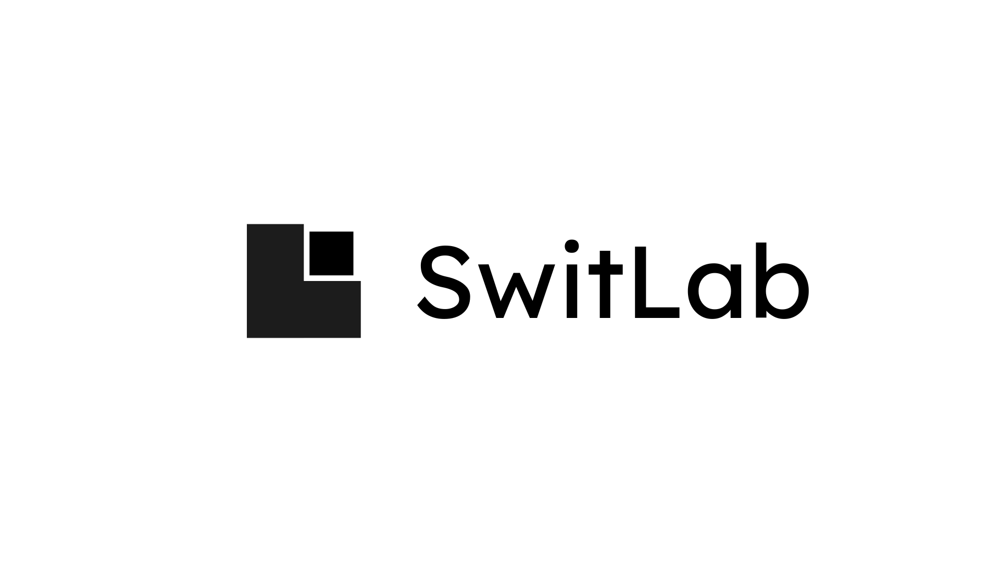
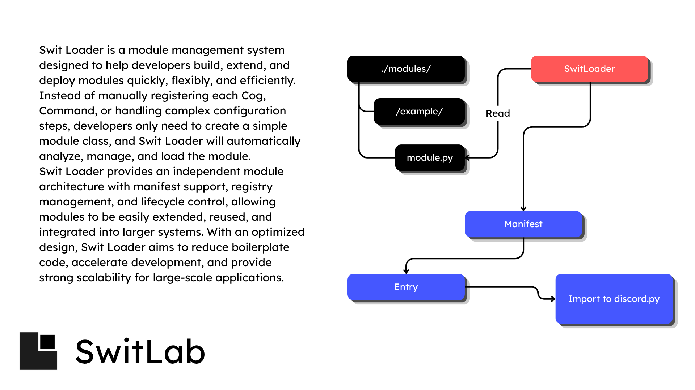

---
> [!NOTE]
> English is not my native language, so some comments and Markdown files were originally written in my native language and then translated with the help of AI. There may be some grammatical mistakes or awkward wording. I appreciate your understanding.
---
# 1. Loader

---
# 2. Installation
## Requirements

> Python 3.13+
> 
> When running, Swit will automatically install the required dependencies.

```bash
git clone -b release https://github.com/Notkenftr/SwitLoader.git
cd SwitLoader

Open config.yml, then set up the bot_token.

```bash
python start.py
```

# 📍 License
MIT License

Copyright (c) 2026 kenftr

Permission is hereby granted, free of charge, to any person obtaining a copy of this software and associated documentation files (the "Software"), to deal in the Software without restriction, including without limitation the rights to use, copy, modify, merge, publish, distribute, sublicense, and/or sell copies of the Software, and to permit persons to whom the Software is furnished to do so, subject to the following conditions:

The above copyright notice and this permission notice shall be included in all copies or substantial portions of the Software.

THE SOFTWARE IS PROVIDED "AS IS", WITHOUT WARRANTY OF ANY KIND, EXPRESS OR IMPLIED, INCLUDING BUT NOT LIMITED TO THE WARRANTIES OF MERCHANTABILITY, FITNESS FOR A PARTICULAR PURPOSE AND NONINFRINGEMENT. IN NO EVENT SHALL THE AUTHORS OR COPYRIGHT HOLDERS BE LIABLE FOR ANY CLAIM, DAMAGES OR OTHER LIABILITY, WHETHER IN AN ACTION OF CONTRACT, TORT OR OTHERWISE, ARISING FROM, OUT OF OR IN CONNECTION WITH THE SOFTWARE OR THE USE OR OTHER DEALINGS IN THE SOFTWARE.